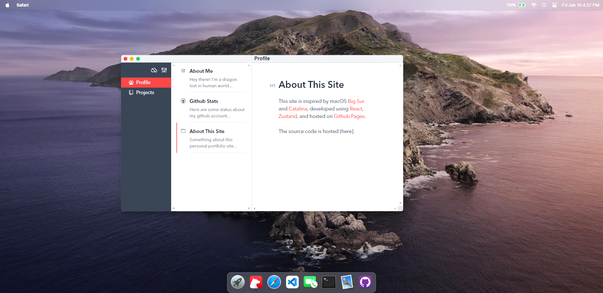
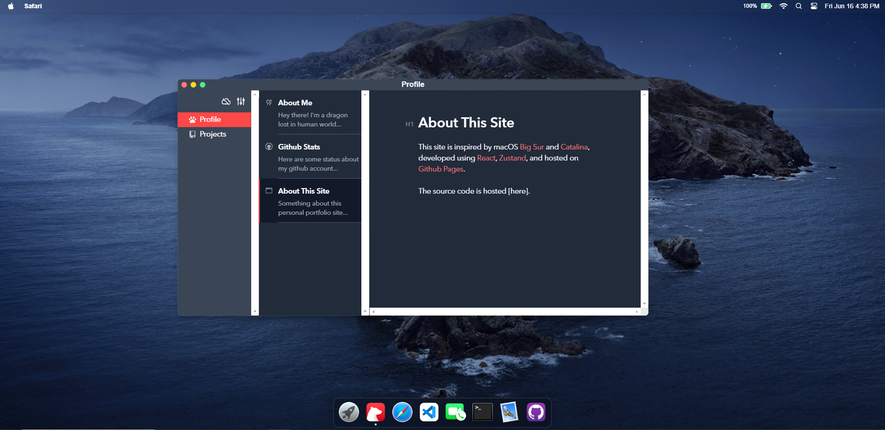

# macos-portfolio

This portfolio website simulating macOS's GUI

Powered by [React](https://reactjs.org/) + [TypeScript](https://www.typescriptlang.org/) + [Vite](https://vitejs.dev/).




&nbsp;

## Usage

Clone the repo and install dependencies:

```bash
npm install
```

Start dev server (with hot reloading):

```bash
npm run dev
```

Build for production with minification to the `dist` folder:

```bash
npm run build
```

&nbsp;

## Changelog

- **Update 2023.12.05**: Simulated the real state of the device's battery using [Battery API](https://developer.mozilla.org/en-US/docs/Web/API/Battery_Status_API). On the [browsers that don't support this API](https://developer.mozilla.org/en-US/docs/Web/API/Battery_Status_API#browser_compatibility), the charge level will be displayed as 100%.

&nbsp;
